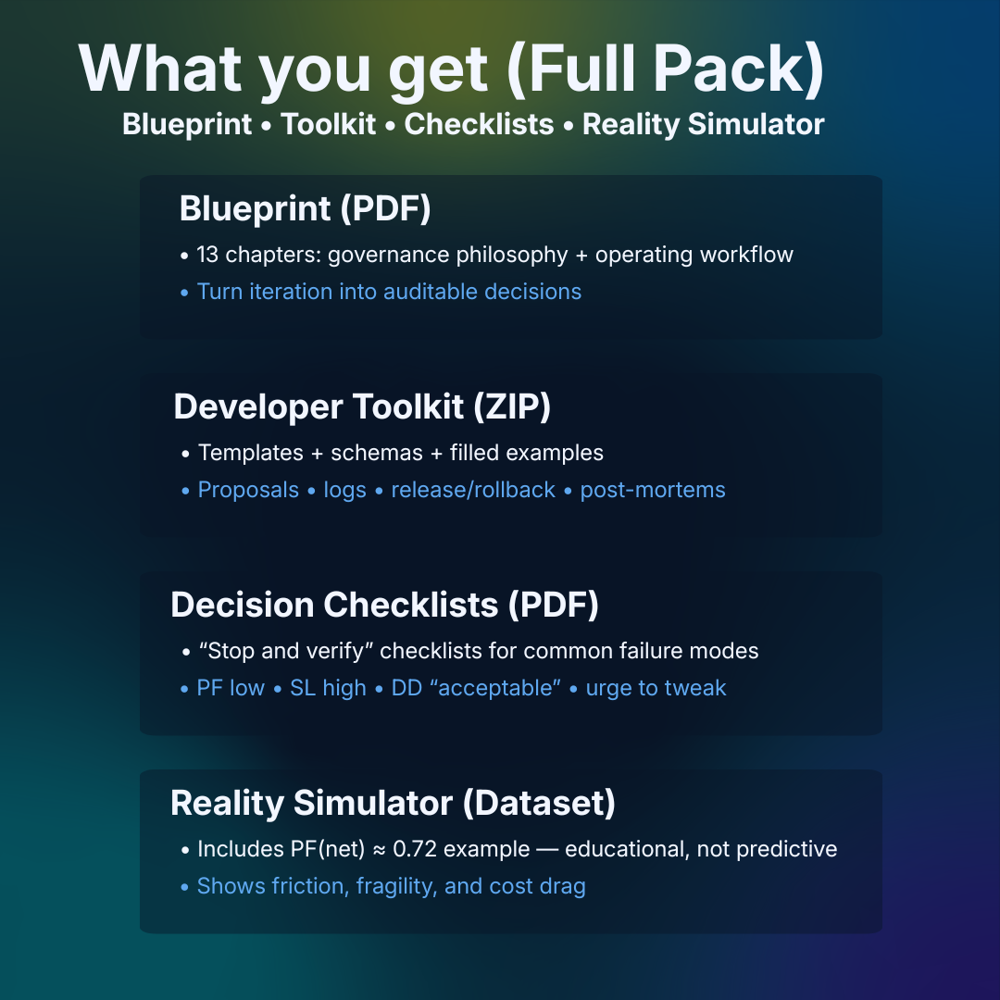
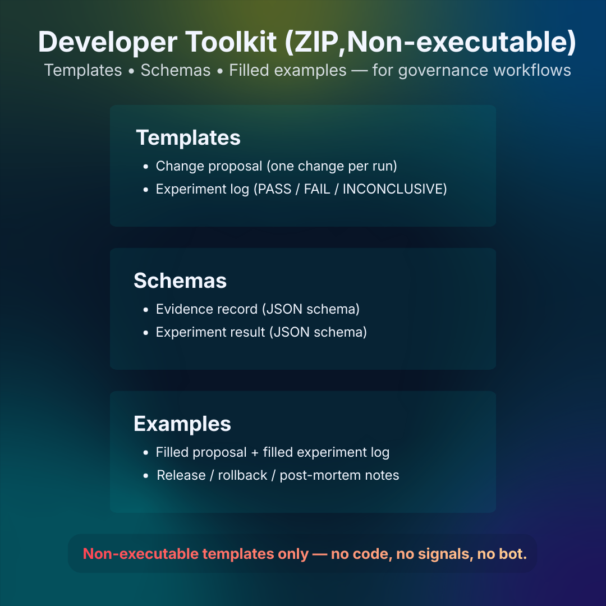

# Trading System Governance (Evidence-Based)

  

Built to enforce one-change-per-run, evidence gates, and traceable decisions—so you stop “one more tweak” iterations.

Evidence-based governance workflow for systematic trading R&D: change proposals, experiment logs, release/rollback discipline.

**Not a bot. Not signals. Not executable trading code.**

---

## Get LEP v1 (Instant download)

➡️ **Buy / Download:** <https://lamplight88.gumroad.com/l/lep-v1>

> This public repo is an informational overview only. The full LEP v1 package is delivered via Gumroad.

---

## Repo docs (read first)

- Disclaimer: [DISCLAIMER.md](DISCLAIMER.md)
- Support policy: [SUPPORT.md](SUPPORT.md)
- Repo license: [LICENSE.md](LICENSE.md)
- Repo changelog: [CHANGELOG.md](CHANGELOG.md)
- Contributing: [CONTRIBUTING.md](CONTRIBUTING.md)

---

## What you get (Full Pack)

---

## Who this is for (and NOT for)

---

## Developer Toolkit (non-executable)

---

## What LEP is (and is NOT)

**LEP v1 is a self-serve governance framework** for systematic traders and developers building trading systems.  
It helps you run disciplined iteration with **one-change-per-run**, evidence gates (**PASS / FAIL / INCONCLUSIVE**), and a traceable decision trail.

**LEP is NOT:**
- a trading strategy
- a signal service
- runnable trading code
- a promise of profitability

---

## Quick start

1. Buy and download the pack.
2. Start with the **START_HERE** guide inside the ZIP.
3. Use the checklists before you touch any system change.

---

## License & policies (summary)

- **Self-serve only. No support or consulting.** (See: [SUPPORT.md](SUPPORT.md))
- **Public repo content license:** informational overview only. No open-source license granted. (See: [LICENSE.md](LICENSE.md))
- **Commercial package terms/license:** the purchased LEP v1 package includes its own Terms & License (personal/internal use; no reselling/redistribution). See the included policy documents inside the purchased package.
- **Case study metrics are educational “reality filter” examples** — not performance claims. (See: [DISCLAIMER.md](DISCLAIMER.md))

---

## Get LEP v1

  

➡️ **Buy / Download:** <https://lamplight88.gumroad.com/l/lep-v1>

